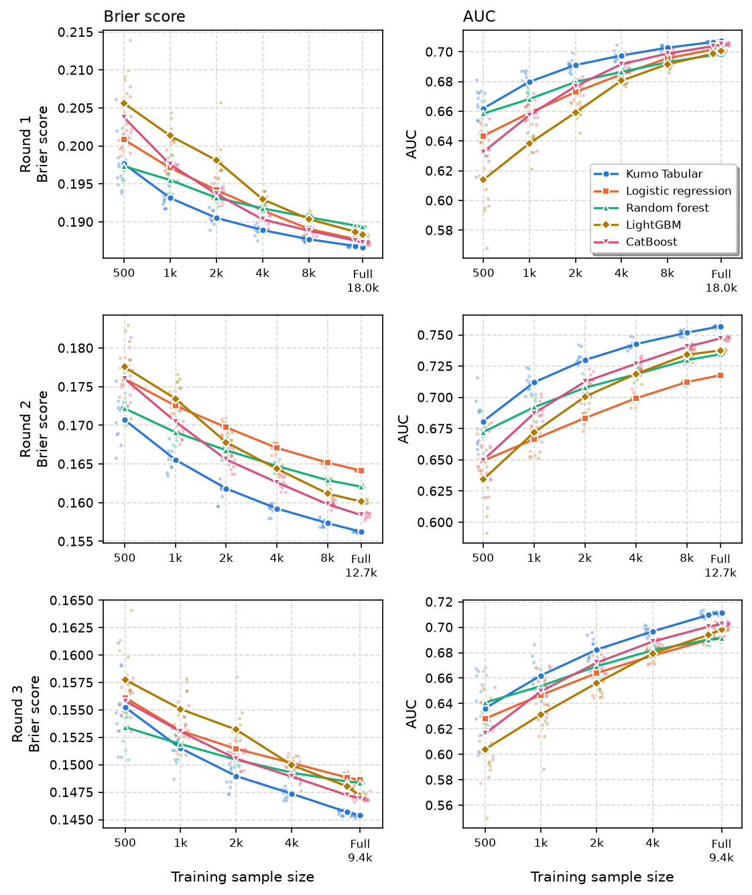

# Tabular foundation models for recidivism prediction with small samples
Andrew P. Wheeler

# Introduction

Most agencies that want a recidivism risk tool do not have tens of thousands of cases to build it on. A probation department in a mid-sized county may release a few hundred people a year. A police department building a list of people at high risk of gun violence may have even fewer outcomes to learn from ([Wheeler, Worden, and Silver 2019](#ref-wheeler2019void)). The NIJ Recidivism Forecasting Challenge gave entrants over 18,000 Georgia parolees to train on ([National Institute of Justice 2021](#ref-nij2021challenge)). That is not the typical situation.

The obvious fix is to borrow a model built somewhere else. That does not work as well as you would hope. Hamilton, Kigerl, and Kowalski ([2022](#ref-hamilton2022local)) show that risk tools tuned to a local population predict better than the same tool carried over from another one; prediction is local. Jurisdictions also just collect different data. One agency has drug test results and employment, another has neither, and a third codes prior arrests in a way nobody else does. A model that expects a set of fields another agency does not have cannot be applied there at all.

So the agency is left fitting its own model on a small sample. Two things go wrong with that. The first is accuracy: machine learning models that need tuning tend to do worse with fewer cases, and small agencies rarely have someone on staff to tune them. The second is variance. With a small holdout sample, the accuracy you measure is itself noisy. On the NIJ data, simply redrawing the train and test split moves the Brier score by about 0.002 and the AUC by about 0.005, which is larger than the gaps between the top teams on the leaderboard ([Wheeler 2021](#ref-wheeler2021variance)). An agency checking whether its model is any good needs some idea of how much those numbers bounce around.

Tabular foundation models are a new option for the first problem. They are neural networks pretrained on millions of synthetic tables. At prediction time you give the model your training rows as context and it returns predictions for new rows in a single forward pass, with no fitting and no hyperparameter tuning ([Hollmann et al. 2025](#ref-hollmann2025tabpfn); [Qu et al. 2026](#ref-qu2026tabiclv2); [NVIDIA 2026a](#ref-nvidia2026kumo)). On public benchmarks they beat tuned gradient boosting, and the gains are largest on small datasets. That is the right shape for the agency problem, but benchmark suites are not criminal justice data, and recidivism is a noisy outcome where most models land in the same place ([Duwe and Kim 2017](#ref-duwe2017out); [Circo and Wheeler 2025](#ref-circo2025replication); [Wheeler 2023](#ref-wheeler2023relaxed)).

This paper tests one of these models, NVIDIA’s Kumo Tabular ([NVIDIA 2026a](#ref-nvidia2026kumo)), on the NIJ data, against logistic regression, a random forest, LightGBM, and CatBoost. I take random samples of 500 to 16,000 people from the NIJ training data, ten samples at each size, fit every model to the same samples, and score them on the NIJ test sample. The ten samples show how much accuracy varies from one draw to the next at each size. I do this for all three rounds of the challenge. Rounds 2 and 3 predict an arrest in year 2 or 3 among people not arrested earlier, and the training data have to be restricted the same way to get those conditional predictions right. I report Brier scores and AUC overall and by race and sex, and compare the full-sample models to the challenge leaderboard.

# Tabular foundation models

Deep learning has not historically done well on tabular data. Tree ensembles, such as random forests and gradient boosting, have been the default, and careful comparisons found they still beat neural networks on typical tables ([Grinsztajn, Oyallon, and Varoquaux 2022](#ref-grinsztajn2022tree)). Criminology has a similar finding for recidivism. Machine learning models are often no better than logistic regression, and when they are, the gains are small ([Duwe and Kim 2017](#ref-duwe2017out)). The NIJ challenge confirmed this: the winning entries in each round were separated in the third or fourth decimal of the Brier score, and those gaps are within what you would expect from sampling variation alone ([Wheeler 2021](#ref-wheeler2021variance); [Circo and Wheeler 2025](#ref-circo2025replication)).

Tabular foundation models change how the model is built. TabPFN was the first widely used one ([Hollmann et al. 2025](#ref-hollmann2025tabpfn)). It is a transformer trained once, ahead of time, on millions of artificial datasets drawn from structural causal models. Each artificial dataset is split into training and test rows, and the network learns to predict the test rows given the training rows. When you use it on real data, “fitting” just means passing your training rows in as context. The network has learned, in effect, how to do supervised learning on small tables. Later models such as TabICLv2 ([Qu et al. 2026](#ref-qu2026tabiclv2)) and Kumo Tabular ([NVIDIA 2026a](#ref-nvidia2026kumo)) follow the same recipe with architectures that scale to larger tables. Kumo Tabular was pretrained only on synthetic tables of up to 100 columns and 60,000 rows, and ranks first on several public benchmarks ([NVIDIA 2026a](#ref-nvidia2026kumo)).

Two features matter for an analyst. There is nothing to tune, so the quality of the model does not depend on how much time someone spent on a hyperparameter search. And the models take mixed numeric and categorical columns with missing values, so less data preparation is needed. The cost is compute. Prediction requires attending over every training row, so the model is slow on a CPU and wants a GPU for larger samples.

# Data and methods

## The NIJ data and the three rounds

The data are the NIJ Recidivism Forecasting Challenge full file: 25,835 people released from Georgia prisons to parole supervision from 2013 through 2015 ([National Institute of Justice 2022](#ref-nij2022data)). NIJ split the file into a training sample of 18,028 and a test sample of 7,807. I keep that split. Every model below is scored on the NIJ test sample, and the test sample is never used to fit or tune anything.

The challenge had three rounds ([National Institute of Justice 2021](#ref-nij2021challenge)). Round 1 forecast a new arrest in the first year after release, using what was known at release: age, sex, supervision level and risk score, education, prison offense and time served, gang membership, residence area (PUMA), prior arrests and convictions, prior revocations, and parole conditions. Rounds 2 and 3 forecast an arrest in year 2 and year 3. For those rounds NIJ added fields that describe supervision: drug tests, employment, program attendance, violations, delinquency reports, and residence changes. I follow the same rules. Round 1 uses only the release fields, and rounds 2 and 3 add the supervision fields. Race is not used as a predictor in any model; it is only used to break out the accuracy metrics. The outcomes for later years are never predictors.

## Why rounds 2 and 3 condition on the prior rounds

In round 2 NIJ’s test sample only included people who were not arrested in year 1. The target is the probability of an arrest in year 2 given no arrest in year 1. In survival terms this is the discrete-time hazard for year 2 ([Wheeler 2020](#ref-wheeler2020discrete)). Round 3 is the hazard for year 3, among people with no arrest in years 1 or 2.

The training data have to be restricted the same way. In the NIJ file the year 2 outcome is 0 for anyone arrested in year 1; they cannot have a first arrest in year 2 because they already had one. If you train a year 2 model on everyone, the people with the highest risk, the ones who failed quickly, are labeled as successes. That biases the predictions down for exactly the kind of person the model should flag, and it drags the overall predicted rate below the rate among the people you will actually score. So for round 2 I train only on training cases with no year 1 arrest, and for round 3 only on cases with no arrest in years 1 or 2. The Circo and Wheeler replication did this for round 2 ([Circo and Wheeler 2025](#ref-circo2025replication)). I show below what happens when you do not.

## Features

There are two versions of the features. The sample-size comparison uses the first, and both are fit to the full training samples for the leaderboard comparison and Appendix B. The first version uses no feature engineering. The columns go in as NIJ distributed them: text fields such as “10 or more” prior felony arrests or “Violent/Non-Sex” prison offense are categories, true and false fields are categories, and missing values are left missing. LightGBM, CatBoost, and Kumo Tabular all accept categorical columns directly. The logistic regression dummy codes them. The random forest needs numbers, so its text columns are replaced with integer codes in alphabetical order, which is what you get when you do not think about it.

The second version is the feature engineering we used in the challenge ([Wheeler 2021](#ref-wheeler2021variance); [Circo and Wheeler 2025](#ref-circo2025replication)). Ordered categories get ordered codes (age groups, education, supervision level, time served, offense severity), top-coded counts keep the leading number, true and false are 0 and 1, missing values get their own code, and there are indicators for the fields that are often missing. I also add totals for prior arrests and prior convictions. For rounds 2 and 3 there are indicators for people with no drug tests and no employment record.

## Models

The four comparison models are logistic regression, a random forest ([Breiman 2001](#ref-breiman2001random); [Pedregosa et al. 2011](#ref-pedregosa2011scikit)), LightGBM ([Ke et al. 2017](#ref-ke2017lightgbm)), and CatBoost ([Prokhorenkova et al. 2018](#ref-prokhorenkova2018catboost)). I give them the light tuning an analyst could do without much effort. The logistic regression has an L2 penalty chosen by five-fold cross-validated Brier score. Its inputs are standardized, text columns are dummy coded with missing as its own level, and numeric columns get a missing indicator. The random forest has 500 trees and picks its minimum leaf size (1, 5, 10, 25, or 50) by out-of-bag Brier score. The two boosted models pick the number of trees by early stopping on a random 20% of the training sample, and are then refit on all of it with that number of trees. Everything else is at the package defaults.

Kumo Tabular is used as it ships, with no tuning: the small model (28 million parameters), 8 ensemble members, run on a GPU ([NVIDIA 2026a](#ref-nvidia2026kumo), [2026b](#ref-nvidia2026sdm)). In a check on the full round 1 sample with four ensemble members, the medium model (71 million parameters) gave the same test Brier score to three decimals as the small one and took about 20 times longer on my 4 GB GPU. The large model did not fit in GPU memory. The appendix repeats the main comparison for two other tabular foundation models, TabICLv2 ([Qu et al. 2026](#ref-qu2026tabiclv2)) and TabPFN version 2 ([Hollmann et al. 2025](#ref-hollmann2025tabpfn)).

## Sample sizes and metrics

For each round I draw simple random samples from the NIJ training data (restricted to the round’s risk set) of 500, 1,000, 2,000, 4,000, 8,000, and 16,000 people, stopping below the size of the risk set, and then use the full training sample. There are ten samples at each size. All five models are fit to the same ten samples, and each model’s random seed is the sample number, so the full-sample replications differ only in the seed.

Accuracy is measured on the NIJ test sample with the Brier score, the mean squared difference between the predicted probability and the 0/1 outcome, and the area under the ROC curve (AUC). Lower Brier scores are better, higher AUC is better. The Brier score was the challenge’s accuracy metric, and it was computed separately for men and women ([National Institute of Justice 2021](#ref-nij2021challenge)). The Brier score rewards calibration as well as ranking. AUC only measures ranking. I report both overall and by race and sex, as in Wheeler ([2026b](#ref-wheeler2026conformal)).

# Results

## Accuracy by sample size

| Sample        | Kumo Tabular    | Logistic regression | Random forest   | LightGBM        | CatBoost        |
|:--------------|:----------------|:--------------------|:----------------|:----------------|:----------------|
| 500           | 0.1976 (0.0038) | 0.2008 (0.0021)     | 0.1973 (0.0020) | 0.2056 (0.0031) | 0.2038 (0.0045) |
| 1,000         | 0.1932 (0.0018) | 0.1971 (0.0012)     | 0.1955 (0.0015) | 0.2013 (0.0016) | 0.1976 (0.0014) |
| 2,000         | 0.1905 (0.0009) | 0.1942 (0.0009)     | 0.1932 (0.0006) | 0.1981 (0.0029) | 0.1937 (0.0008) |
| 4,000         | 0.1889 (0.0007) | 0.1915 (0.0007)     | 0.1918 (0.0004) | 0.1930 (0.0007) | 0.1903 (0.0009) |
| 8,000         | 0.1877 (0.0003) | 0.1891 (0.0004)     | 0.1906 (0.0003) | 0.1904 (0.0007) | 0.1888 (0.0008) |
| 16,000        | 0.1868 (0.0001) | 0.1878 (0.0001)     | 0.1895 (0.0001) | 0.1887 (0.0004) | 0.1876 (0.0004) |
| Full (18,028) | 0.1866 (0.0000) | 0.1876 (0.0000)     | 0.1893 (0.0001) | 0.1883 (0.0001) | 0.1872 (0.0002) |

<a href="#fig-curves" class="quarto-xref">Figure 1</a> shows the results for each round, and <a href="#tbl-round1" class="quarto-xref">Table 1</a> gives the round 1 Brier scores. Start with round 1. With 500 people, the random forest and Kumo Tabular are tied on the Brier score (0.1973 and 0.1976), and the two boosted models are the worst. Kumo has the higher AUC, 0.662 against 0.658. From 1,000 people on, Kumo has the best average Brier score and AUC at every size. Because every model gets the same ten samples, the comparisons are paired. From 1,000 through 4,000 people Kumo has a lower Brier score than every other model in every one of the ten samples.

The easiest way to read the gap is in sample size. Kumo with 1,000 people (0.1932) does about as well as the random forest or logistic regression with 2,000 (0.1932 and 0.1942). Kumo with 2,000 (0.1905) matches CatBoost with 4,000 (0.1903), and Kumo with 4,000 matches CatBoost with 8,000. For a small agency, the foundation model is worth about as much as doubling the sample.

The advantage shrinks as the sample grows. With the full training sample of 18,028, Kumo’s Brier score is 0.1866, CatBoost’s is 0.1872, and logistic regression’s is 0.1876. Differences of 0.001 are well within what a different test sample would produce ([Wheeler 2021](#ref-wheeler2021variance)). LightGBM and the random forest trail at every size past 4,000. Logistic regression is never far from CatBoost, which is the usual finding for recidivism data ([Duwe and Kim 2017](#ref-duwe2017out)).

The spread across the ten samples is the other half of the story. At 500 people the standard deviation of the Brier score is between 0.0020 and 0.0045 depending on the model, and the AUC varies by one to two and a half points (standard deviations of 0.011 to 0.025). By 2,000 people the AUC standard deviations are around 0.005, and the Brier standard deviations are under 0.001 for every model but LightGBM, which has one poor draw at that size. Keep in mind this is only the variation from the training draw. Every score here is on the same NIJ test sample of 7,807 people. An agency with 500 cases would also be testing on a small holdout, which adds its own noise on top.

## Race and sex

| Metric | Sample | Group       | N test | Kumo  | Logit | RF    | LightGBM | CatBoost |
|:-------|:-------|:------------|:-------|:------|:------|:------|:---------|:---------|
| Brier  | 1,000  | Black men   | 4,195  | 0.203 | 0.207 | 0.205 | 0.211    | 0.207    |
| Brier  | 1,000  | White men   | 2,662  | 0.189 | 0.193 | 0.192 | 0.198    | 0.194    |
| Brier  | 1,000  | Black women | 339    | 0.156 | 0.160 | 0.160 | 0.166    | 0.162    |
| Brier  | 1,000  | White women | 611    | 0.163 | 0.163 | 0.164 | 0.168    | 0.166    |
| Brier  | Full   | Black men   | 4,195  | 0.196 | 0.197 | 0.199 | 0.198    | 0.197    |
| Brier  | Full   | White men   | 2,662  | 0.183 | 0.183 | 0.185 | 0.184    | 0.184    |
| Brier  | Full   | Black women | 339    | 0.150 | 0.151 | 0.154 | 0.154    | 0.151    |
| Brier  | Full   | White women | 611    | 0.157 | 0.159 | 0.158 | 0.158    | 0.157    |
| AUC    | 1,000  | Black men   | 4,195  | 0.665 | 0.640 | 0.653 | 0.624    | 0.644    |
| AUC    | 1,000  | White men   | 2,662  | 0.693 | 0.675 | 0.683 | 0.652    | 0.669    |
| AUC    | 1,000  | Black women | 339    | 0.742 | 0.723 | 0.730 | 0.685    | 0.717    |
| AUC    | 1,000  | White women | 611    | 0.648 | 0.639 | 0.643 | 0.613    | 0.628    |
| AUC    | Full   | Black men   | 4,195  | 0.694 | 0.688 | 0.682 | 0.686    | 0.691    |
| AUC    | Full   | White men   | 2,662  | 0.718 | 0.715 | 0.712 | 0.714    | 0.716    |
| AUC    | Full   | Black women | 339    | 0.760 | 0.752 | 0.756 | 0.748    | 0.760    |
| AUC    | Full   | White women | 611    | 0.683 | 0.673 | 0.681 | 0.674    | 0.689    |

<a href="#tbl-groups" class="quarto-xref">Table 2</a> breaks the round 1 results out by race and sex. With 1,000 training cases, Kumo has the lowest Brier score and highest AUC in all four groups, except that logistic regression ties it on the Brier score for White women. The groups differ more from each other than the models do. Black women have the highest AUC for every model, White women and Black men the lowest, and women have much lower Brier scores than men because fewer of them are arrested. With the full training sample the models are close in every group, and CatBoost has a slightly higher AUC than Kumo for White women (0.689 against 0.683). The test sample has only 611 White women and 339 Black women, so the group AUCs for women move around by a point or more from one draw to the next.

## Rounds 2 and 3

| Round | Model        | Training data | N train | Test arrest rate | Mean prediction | Brier  | AUC   |
|:------|:-------------|:--------------|:--------|:-----------------|:----------------|:-------|:------|
| 2     | CatBoost     | risk set      | 12,651  | 24.1%            | 25.3%           | 0.1581 | 0.748 |
| 2     | CatBoost     | naive         | 18,028  | 24.1%            | 17.7%           | 0.1718 | 0.700 |
| 2     | Kumo Tabular | risk set      | 12,651  | 24.1%            | 25.3%           | 0.1564 | 0.756 |
| 2     | Kumo Tabular | naive         | 18,028  | 24.1%            | 18.2%           | 0.1700 | 0.698 |
| 3     | CatBoost     | risk set      | 9,398   | 19.8%            | 18.9%           | 0.1472 | 0.701 |
| 3     | CatBoost     | naive         | 18,028  | 19.8%            | 10.2%           | 0.1642 | 0.622 |
| 3     | Kumo Tabular | risk set      | 9,398   | 19.8%            | 19.0%           | 0.1449 | 0.714 |
| 3     | Kumo Tabular | naive         | 18,028  | 19.8%            | 10.7%           | 0.1616 | 0.631 |

<a href="#tbl-conditional" class="quarto-xref">Table 3</a> shows why the later rounds have to condition on the earlier ones. Fit on everyone, with earlier arrests coded as 0, the models predict too low. In round 2 the naive CatBoost model’s average prediction is 17.7% for a group where 24.1% are arrested, and in round 3 it is 10.2% against 19.8%. The ranking gets worse too, not just the calibration. The round 3 AUC falls from 0.701 to 0.622, because the people who look riskiest in the training data are the ones who failed early and were labeled 0. Kumo has the same problem. No model fixes a mislabeled target, so everything else in this paper uses the risk set.

The lower panels of <a href="#fig-curves" class="quarto-xref">Figure 1</a> show rounds 2 and 3. Here Kumo’s lead is larger and does not close as the sample grows. In round 2 it has the lowest Brier score in every sample against every model at every size, except for two of the ten samples of 500 where the random forest wins. With the full round 2 sample of 12,651, Kumo’s Brier score is 0.1562 against 0.1584 for CatBoost and 0.1642 for logistic regression, and its AUC is 0.757 against 0.747 and 0.718. Kumo with 2,000 people (0.1618) beats logistic regression on the full sample, and Kumo with 4,000 (0.1592) beats CatBoost with 8,000 (0.1598).

The rounds 2 and 3 models add the supervision fields: drug test results, employment, program attendance, and violations. Logistic regression falls behind the tree models once those are in, which suggests they matter in nonlinear ways or through interactions that a main-effects logit does not have. Kumo picks those up without being told. Round 3 has fewer arrests to learn from, and at 500 people the random forest beats Kumo in eight of ten samples. From 2,000 people on, Kumo is ahead of every model in every sample. With the full round 3 sample, Kumo’s full-sample Brier score is 0.1454, CatBoost’s is 0.1469, and logistic regression’s is 0.1486.

## Comparison to the challenge leaderboard

| Round | Entry                       | Men    | Women  | Average |
|:------|:----------------------------|:-------|:-------|:--------|
| 1     | Kumo Tabular                | 0.1910 | 0.1548 | 0.1729  |
| 1     | Logistic regression         | 0.1920 | 0.1560 | 0.1740  |
| 1     | Random forest               | 0.1939 | 0.1562 | 0.1751  |
| 1     | LightGBM                    | 0.1927 | 0.1566 | 0.1746  |
| 1     | CatBoost                    | 0.1918 | 0.1546 | 0.1732  |
| 1     | Kumo Tabular, engineered    | 0.1911 | 0.1544 | 0.1727  |
| 1     | Leaderboard, small team 1st | 0.1916 | 0.1542 | 0.1733  |
| 1     | Leaderboard, small team 4th | 0.1922 | 0.1555 | 0.1740  |
| 1     | Leaderboard, large team 1st | 0.1900 | 0.1538 | 0.1719  |
| 1     | Leaderboard, large team 5th | 0.1914 | 0.1552 | 0.1734  |
| 2     | Kumo Tabular                | 0.1617 | 0.1216 | 0.1416  |
| 2     | Logistic regression         | 0.1699 | 0.1276 | 0.1487  |
| 2     | Random forest               | 0.1673 | 0.1287 | 0.1480  |
| 2     | LightGBM                    | 0.1656 | 0.1256 | 0.1456  |
| 2     | CatBoost                    | 0.1637 | 0.1246 | 0.1442  |
| 2     | Kumo Tabular, engineered    | 0.1616 | 0.1222 | 0.1419  |
| 2     | Leaderboard, small team 1st | 0.1658 | 0.1233 | 0.1450  |
| 2     | Leaderboard, small team 4th | 0.1685 | 0.1263 | 0.1481  |
| 2     | Leaderboard, large team 1st | 0.1542 | 0.1196 | 0.1369  |
| 2     | Leaderboard, large team 5th | 0.1638 | 0.1245 | 0.1442  |
| 3     | Kumo Tabular                | 0.1502 | 0.1175 | 0.1339  |
| 3     | Logistic regression         | 0.1540 | 0.1177 | 0.1358  |
| 3     | Random forest               | 0.1535 | 0.1184 | 0.1360  |
| 3     | LightGBM                    | 0.1518 | 0.1206 | 0.1362  |
| 3     | CatBoost                    | 0.1517 | 0.1193 | 0.1355  |
| 3     | Kumo Tabular, engineered    | 0.1498 | 0.1168 | 0.1333  |
| 3     | Leaderboard, small team 1st | 0.1524 | 0.1161 | 0.1358  |
| 3     | Leaderboard, small team 4th | 0.1534 | 0.1182 | 0.1363  |
| 3     | Leaderboard, large team 1st | 0.1463 | 0.1139 | 0.1305  |
| 3     | Leaderboard, large team 5th | 0.1507 | 0.1173 | 0.1343  |

<a href="#tbl-leaderboard" class="quarto-xref">Table 4</a> puts the full-sample models next to the published leaderboard. NIJ scored men and women separately, and the average column is the mean of the two. Kumo Tabular, with no feature engineering and no tuning, would have been competitive in every round. In round 1 its Brier score for men, 0.1910, is lower than the small team winner’s 0.1916, and its average is lower than the small team’s best average. In round 2 it beats the small team winners in all three columns by a wide margin. Round 2 was the one Gio Circo and I won for small teams ([Circo and Wheeler 2025](#ref-circo2025replication)), so the off-the-shelf model does better than our tuned XGBoost did. In round 3 it beats the small team winners for men and on the average, not for women.

It does not beat the large team winners in rounds 2 and 3. TrueFit and IdleSpeculation had average Brier scores of 0.1369 in round 2 and 0.1305 in round 3, against Kumo’s 0.1416 and 0.1339. Those gaps are bigger than leaderboard noise, so those teams found something in the supervision data that Kumo does not. Engineered features do not close the gap: Kumo’s round 2 average is essentially unchanged with them.

Two caveats. First, the leaderboard and the models here are scored on the same single test sample, so differences of a thousandth or two are within noise ([Wheeler 2021](#ref-wheeler2021variance)). Second, several entries adjusted their predictions to do well on the fairness prize, which costs a little accuracy ([Wheeler 2021](#ref-wheeler2021variance); [Mohler and Porter 2021](#ref-mohler2021note)). Neither point changes the conclusion that an off-the-shelf foundation model lands among the better entries.

# Discussion

An off-the-shelf tabular foundation model, with no tuning and no feature engineering, predicted recidivism on the NIJ data as well as or better than the usual machine learning models at every sample size past 1,000. The gain is largest where agencies actually are. With 1,000 to 4,000 cases it is worth about the same as doubling the sample. With the full samples the models mostly converge in round 1, but Kumo keeps a clear lead in rounds 2 and 3, where the supervision fields matter. Against the challenge leaderboard it lands at or above the small team winners, including the model Gio Circo and I built.

For a small agency the practical advice is simple. If you have a few thousand cases, fit a foundation model alongside whatever you would have used, and compare them on a holdout. Expect the accuracy numbers to bounce around: with 500 cases, the AUC moved by one to two and a half points from one training draw to the next even with a large, fixed test sample. With 500 cases, a random forest was as good or better, so there is no free lunch at the smallest sizes.

The later rounds also need the right training data. A model for the chance of an arrest in year 2 has to be trained on people who were not arrested in year 1. Training on everyone labels the early failures as successes, and no model can recover from that.

## Other applications

Nothing here is specific to parole. Police departments that keep lists of people at high risk of being involved in gun violence face the same problem with even smaller samples. The Violent Offender Identification Directive in Syracuse is a point-based tool of this kind ([Wheeler, Worden, and Silver 2019](#ref-wheeler2019void)), and a department building one only has its own local history to learn from. The same goes for place-based prediction, where the rows are street segments or grid cells and the features are counts of nearby risk factors ([Wheeler and Steenbeek 2021](#ref-wheeler2021rtm)). I have not tested either one.

There are also foundation models for time series, built the same way. Crime analysts spend much of their time asking whether this month’s count is unusual, which is a forecasting question with an error band ([Wheeler 2016](#ref-wheeler2016tables), [2026a](#ref-wheeler2026decomp); [Yim, Riddell, and Wheeler 2020](#ref-yim2020homicide); [Wheeler and Kovandzic 2018](#ref-wheeler2018volatile)). Whether a pretrained forecaster gives sensible bands for short, noisy crime series is an open question. The recidivism problem itself is a survival problem. This paper followed the challenge and fit each year as its own risk set. A more natural setup would stack the person-years into one discrete-time dataset, with year as a feature, and fit the hazard in one model ([Wheeler 2020](#ref-wheeler2020discrete)). It is not clear how well the tabular models handle that stacked structure, since the rows for the same person are not independent draws.

## Limitations

A tabular foundation model is a complicated black box. Tens of millions of parameters decide how much weight a prior arrest gets, and nobody can read them off. For decisions about someone’s liberty, Rudin ([2019](#ref-rudin2019stop)) argues for models people can inspect, and simple models often predict recidivism about as well as complex ones ([Rudin, Wang, and Coker 2020](#ref-rudin2020secrecy)). An agency may reasonably prefer a checklist that is a little less accurate. The results here tell you how much accuracy you give up for that choice at a given sample size.

More accurate is not the same as fair. The appendix reports the challenge’s fairness measure, the difference in false positive rates between Black and White parolees at a 0.5 threshold, for the unadjusted predictions. There is no guarantee a better model narrows that gap, and equal error rates are one of several fairness definitions that conflict with each other ([Chohlas-Wood et al. 2026](#ref-chohlas2026learning)). In practice a more accurate model often makes it easier to meet a fairness constraint, since the scores separate the groups’ outcomes better. If a constraint is required, the predictions can be post-processed to meet it, for example by setting group-specific thresholds to equalize the false positive rate ([Wheeler 2026b](#ref-wheeler2026conformal)).

The models also need hardware. The small Kumo model ran in about 90 seconds on the full round 1 sample on an older consumer GPU with 4 GB of memory (a GeForce GTX 1650), and took over ten minutes on a four-core CPU. For a risk tool that scores a batch of cases once a week that does not matter. It does mean an agency needs either a GPU or patience.

Last, this is one dataset. The NIJ data are clean, the features were prepared by NIJ, and the outcome is a single arrest indicator. Local agency data are messier. That is an argument for the foundation models, since they accept messy columns as is, but it is an argument I have not tested here.

# AI use disclosure

The code, analysis, and text were produced with Claude Code (Anthropic, Claude Opus 5.5) under my direction. I specified the research question, the NIJ data and the three rounds, the conditioning of rounds 2 and 3 on the prior rounds, the comparison models, the sample sizes and ten replications, the feature engineering from my earlier posts and the Circo and Wheeler replication, the leaderboard comparison, the appendix analyses, and the sources to cite for the introduction and discussion. All numbers and figures are computed from the data and scripts in the repository.

# References

Breiman, Leo. 2001. “Random Forests.” *Machine Learning* 45 (1): 5–32. <https://doi.org/10.1023/A:1010933404324>.

Chohlas-Wood, Alex, Madison Coots, Henry Zhu, Emma Brunskill, and Sharad Goel. 2026. “Learning to Be Fair: A Consequentialist Approach to Equitable Decision Making.” *Management Science* 72 (1): 456–73. <https://doi.org/10.1287/mnsc.2022.00345>.

Circo, Giovanni M., and Andrew P. Wheeler. 2025. “An Open Source Replication of a Winning Recidivism Prediction Model.” *International Journal of Offender Therapy and Comparative Criminology* 69 (5): 438–53. <https://doi.org/10.1177/0306624X221133004>.

Duwe, Grant, and KiDeuk Kim. 2017. “Out with the Old and in with the New? An Empirical Comparison of Supervised Learning Algorithms to Predict Recidivism.” *Criminal Justice Policy Review* 28 (6): 570–600. <https://doi.org/10.1177/0887403415604899>.

Grinsztajn, Léo, Edouard Oyallon, and Gaël Varoquaux. 2022. “Why Do Tree-Based Models Still Outperform Deep Learning on Typical Tabular Data?” In *Advances in Neural Information Processing Systems*, 35:507–20.

Hamilton, Zachary, Alex Kigerl, and Melanie Kowalski. 2022. “Prediction Is Local: The Benefits of Risk Assessment Optimization.” *Justice Quarterly* 39 (4): 722–44. <https://doi.org/10.1080/07418825.2021.1894215>.

Hollmann, Noah, Samuel Müller, Lennart Purucker, Arjun Krishnakumar, Max Körfer, Shi Bin Hoo, Robin Tibor Schirrmeister, and Frank Hutter. 2025. “Accurate Predictions on Small Data with a Tabular Foundation Model.” *Nature* 637: 319–26. <https://doi.org/10.1038/s41586-024-08328-6>.

Ke, Guolin, Qi Meng, Thomas Finley, Taifeng Wang, Wei Chen, Weidong Ma, Qiwei Ye, and Tie-Yan Liu. 2017. “LightGBM: A Highly Efficient Gradient Boosting Decision Tree.” In *Advances in Neural Information Processing Systems*. Vol. 30.

Mohler, George, and Michael D. Porter. 2021. “A Note on the Multiplicative Fairness Score in the NIJ Recidivism Forecasting Challenge.” *Crime Science* 10: 17. <https://doi.org/10.1186/s40163-021-00152-x>.

National Institute of Justice. 2021. “Recidivism Forecasting Challenge.” <https://nij.ojp.gov/funding/recidivism-forecasting-challenge>.

———. 2022. “NIJ’s Recidivism Challenge Full Dataset.” <https://data.ojp.usdoj.gov/Courts/NIJ-s-Recidivism-Challenge-Full-Dataset/ynf5-u8nk>.

NVIDIA. 2026a. “NVIDIA Kumo Tabular: An Open Foundation Model for Tabular Classification and Regression.” <https://huggingface.co/blog/nvidia/kumo-tabular>.

———. 2026b. “Structured Data Models.” <https://github.com/NVIDIA/structured-data-models>.

Pedregosa, Fabian, Gaël Varoquaux, Alexandre Gramfort, Vincent Michel, Bertrand Thirion, Olivier Grisel, Mathieu Blondel, et al. 2011. “Scikit-Learn: Machine Learning in Python.” *Journal of Machine Learning Research* 12: 2825–30.

Prokhorenkova, Liudmila, Gleb Gusev, Aleksandr Vorobev, Anna Veronika Dorogush, and Andrey Gulin. 2018. “CatBoost: Unbiased Boosting with Categorical Features.” In *Advances in Neural Information Processing Systems*. Vol. 31.

Qu, Jingang, David Holzmüller, Gaël Varoquaux, and Marine Le Morvan. 2026. “TabICLv2: A Better, Faster, Scalable, and Open Tabular Foundation Model.” *arXiv Preprint arXiv:2602.11139*.

Rudin, Cynthia. 2019. “Stop Explaining Black Box Machine Learning Models for High Stakes Decisions and Use Interpretable Models Instead.” *Nature Machine Intelligence* 1 (5): 206–15. <https://doi.org/10.1038/s42256-019-0048-x>.

Rudin, Cynthia, Caroline Wang, and Beau Coker. 2020. “The Age of Secrecy and Unfairness in Recidivism Prediction.” *Harvard Data Science Review* 2 (1). <https://doi.org/10.1162/99608f92.6ed64b30>.

Wheeler, Andrew P. 2016. “Tables and Graphs for Monitoring Temporal Crime Trends: Translating Theory into Practical Crime Analysis Advice.” *International Journal of Police Science & Management* 18 (3): 159–72. <https://doi.org/10.1177/1461355716642781>.

———. 2020. “Discrete Time Survival Models in Python.” <https://andrewpwheeler.com/2020/09/26/discrete-time-survival-models-in-python/>.

———. 2021. “Variance of Leaderboard Metrics for Competitions.” <https://andrewpwheeler.com/2021/07/24/variance-of-leaderboard-metrics-for-competitions/>.

———. 2023. “Too Relaxed? Naive Bayes Does Not Improve Recidivism Forecasting in the NIJ Challenge.” <https://andrewpwheeler.com/2023/07/17/too-relaxed-naive-bayes-does-not-improve-recidivism-forecasting-in-the-nij-challenge/>.

———. 2026a. “Monthly Crime Trends: Global Patterns and City Departures.” <https://github.com/apwheele/CrimeDecomp>.

———. 2026b. “Setting Equal False Positive Rates for Recidivism Risk Scores with Conformal Prediction.” <https://github.com/apwheele/ConformalFair>.

Wheeler, Andrew P., and Tomislav V. Kovandzic. 2018. “Monitoring Volatile Homicide Trends Across U.S. Cities.” *Homicide Studies* 22 (2): 119–44. <https://doi.org/10.1177/1088767917740171>.

Wheeler, Andrew P., and Wouter Steenbeek. 2021. “Mapping the Risk Terrain for Crime Using Machine Learning.” *Journal of Quantitative Criminology* 37 (2): 445–80. <https://doi.org/10.1007/s10940-020-09457-7>.

Wheeler, Andrew P., Robert E. Worden, and Jasmine R. Silver. 2019. “The Accuracy of the Violent Offender Identification Directive Tool to Predict Future Gun Violence.” *Criminal Justice and Behavior* 46 (5): 770–88. <https://doi.org/10.1177/0093854818824378>.

Yim, Ha-Neul, Jordan R. Riddell, and Andrew P. Wheeler. 2020. “Is the Recent Increase in National Homicide Abnormal? Testing the Application of Fan Charts in Monitoring National Homicide Trends over Time.” *Journal of Criminal Justice* 66: 101656. <https://doi.org/10.1016/j.jcrimjus.2019.101656>.

# Appendix

## A. Other tabular foundation models

| Round | Sample | Kumo Tabular   | TabICLv2       | TabPFN v2      | CatBoost       |
|:------|:-------|:---------------|:---------------|:---------------|:---------------|
| 1     | 500    | 0.1976 / 0.662 | 0.1999 / 0.658 | 0.1972 / 0.665 | 0.2038 / 0.633 |
| 1     | 1,000  | 0.1932 / 0.680 | 0.1943 / 0.677 | 0.1939 / 0.677 | 0.1976 / 0.657 |
| 1     | 2,000  | 0.1905 / 0.691 | 0.1913 / 0.689 | 0.1913 / 0.688 | 0.1937 / 0.677 |
| 1     | 4,000  | 0.1889 / 0.698 | 0.1897 / 0.695 | – / –          | 0.1903 / 0.692 |
| 1     | Full   | 0.1866 / 0.707 | 0.1870 / 0.706 | – / –          | 0.1872 / 0.705 |
| 2     | 500    | 0.1707 / 0.681 | 0.1738 / 0.662 | 0.1726 / 0.664 | 0.1760 / 0.650 |
| 2     | 1,000  | 0.1656 / 0.712 | 0.1695 / 0.689 | 0.1685 / 0.700 | 0.1705 / 0.687 |
| 2     | 2,000  | 0.1618 / 0.730 | 0.1657 / 0.707 | 0.1628 / 0.728 | 0.1656 / 0.713 |
| 2     | 4,000  | 0.1592 / 0.743 | 0.1613 / 0.731 | – / –          | 0.1626 / 0.727 |
| 2     | Full   | 0.1562 / 0.757 | 0.1582 / 0.746 | – / –          | 0.1584 / 0.747 |
| 3     | 500    | 0.1552 / 0.636 | 0.1581 / 0.626 | 0.1553 / 0.627 | 0.1558 / 0.616 |
| 3     | 1,000  | 0.1515 / 0.662 | 0.1542 / 0.645 | 0.1522 / 0.655 | 0.1530 / 0.650 |
| 3     | 2,000  | 0.1490 / 0.682 | 0.1510 / 0.670 | 0.1514 / 0.665 | 0.1505 / 0.672 |
| 3     | 4,000  | 0.1474 / 0.697 | 0.1492 / 0.689 | – / –          | 0.1489 / 0.689 |
| 3     | Full   | 0.1454 / 0.711 | 0.1475 / 0.705 | – / –          | 0.1469 / 0.702 |

Kumo is not the only foundation model that works here. TabICLv2 ([Qu et al. 2026](#ref-qu2026tabiclv2)) and TabPFN version 2 ([Hollmann et al. 2025](#ref-hollmann2025tabpfn)) both beat CatBoost at the small sample sizes in round 1, and all three foundation models are within a few thousandths of each other there. Kumo is the best of the three in most cells, and its lead is clearest in round 2. TabICLv2 ran about as fast as Kumo on my GPU. TabPFN version 2 is limited to 10,000 training rows by its authors and was much slower, 152 seconds per fit at 2,000 people against 16 for Kumo, so I only ran it up to 2,000 people with three samples per size. The ranking among the foundation models could easily change with newer versions. The point is that the gain over tuned boosting is not specific to one model.

## B. Raw versus engineered features

| Round | Model               | Brier raw | Brier engineered | AUC raw | AUC engineered |
|:------|:--------------------|:----------|:-----------------|:--------|:---------------|
| 1     | Kumo Tabular        | 0.1866    | 0.1866           | 0.707   | 0.707          |
| 1     | Logistic regression | 0.1876    | 0.1890           | 0.702   | 0.697          |
| 1     | Random forest       | 0.1893    | 0.1888           | 0.699   | 0.701          |
| 1     | LightGBM            | 0.1883    | 0.1880           | 0.701   | 0.702          |
| 1     | CatBoost            | 0.1872    | 0.1872           | 0.705   | 0.706          |
| 2     | Kumo Tabular        | 0.1562    | 0.1563           | 0.757   | 0.757          |
| 2     | Logistic regression | 0.1642    | 0.1657           | 0.718   | 0.710          |
| 2     | Random forest       | 0.1621    | 0.1620           | 0.735   | 0.734          |
| 2     | LightGBM            | 0.1602    | 0.1591           | 0.738   | 0.743          |
| 2     | CatBoost            | 0.1584    | 0.1581           | 0.747   | 0.747          |
| 3     | Kumo Tabular        | 0.1454    | 0.1449           | 0.711   | 0.714          |
| 3     | Logistic regression | 0.1486    | 0.1487           | 0.691   | 0.689          |
| 3     | Random forest       | 0.1484    | 0.1484           | 0.691   | 0.689          |
| 3     | LightGBM            | 0.1472    | 0.1480           | 0.698   | 0.698          |
| 3     | CatBoost            | 0.1469    | 0.1471           | 0.702   | 0.703          |

The feature engineering barely matters with the full samples. The tree models move by a thousandth of a Brier point or less either way, and Kumo moves by less than that. Logistic regression is the one case where the engineered version is worse, 0.1890 against 0.1876 in round 1. The raw version dummy codes every category, so it can fit a separate effect for each level of a count like prior felony arrests, while the engineered version treats those counts as a straight line. A tree model does not care about the difference, which is part of why it did not matter much for the other models.

## C. NIJ fairness metric

| Round | Model               | Sex   | FPR Black | FPR White | Difference | Brier  | NIJ score |
|:------|:--------------------|:------|:----------|:----------|:-----------|:-------|:----------|
| 1     | Kumo Tabular        | Men   | 6.3%      | 6.3%      | -0.0%      | 0.1911 | 0.8088    |
| 1     | Kumo Tabular        | Women | 0.0%      | 1.0%      | -1.0%      | 0.1549 | 0.8364    |
| 1     | Logistic regression | Men   | 6.6%      | 7.2%      | -0.6%      | 0.1920 | 0.8036    |
| 1     | Logistic regression | Women | 0.0%      | 1.0%      | -1.0%      | 0.1560 | 0.8353    |
| 1     | Random forest       | Men   | 3.7%      | 3.7%      | 0.0%       | 0.1940 | 0.8057    |
| 1     | Random forest       | Women | 0.0%      | 0.2%      | -0.2%      | 0.1565 | 0.8418    |
| 1     | LightGBM            | Men   | 6.2%      | 6.2%      | 0.0%       | 0.1927 | 0.8072    |
| 1     | LightGBM            | Women | 0.0%      | 1.5%      | -1.5%      | 0.1567 | 0.8311    |
| 1     | CatBoost            | Men   | 5.9%      | 5.2%      | 0.7%       | 0.1920 | 0.8026    |
| 1     | CatBoost            | Women | 0.0%      | 0.4%      | -0.4%      | 0.1549 | 0.8416    |
| 2     | Kumo Tabular        | Men   | 4.5%      | 3.4%      | 1.1%       | 0.1615 | 0.8289    |
| 2     | Kumo Tabular        | Women | 0.0%      | 0.8%      | -0.8%      | 0.1217 | 0.8715    |
| 2     | Logistic regression | Men   | 6.1%      | 3.9%      | 2.2%       | 0.1699 | 0.8121    |
| 2     | Logistic regression | Women | 0.4%      | 0.8%      | -0.3%      | 0.1276 | 0.8695    |
| 2     | Random forest       | Men   | 1.4%      | 1.3%      | 0.1%       | 0.1672 | 0.8321    |
| 2     | Random forest       | Women | 0.0%      | 0.3%      | -0.3%      | 0.1288 | 0.8689    |
| 2     | LightGBM            | Men   | 3.9%      | 3.1%      | 0.7%       | 0.1653 | 0.8285    |
| 2     | LightGBM            | Women | 0.0%      | 1.8%      | -1.8%      | 0.1264 | 0.8577    |
| 2     | CatBoost            | Men   | 4.7%      | 3.0%      | 1.7%       | 0.1641 | 0.8217    |
| 2     | CatBoost            | Women | 0.0%      | 0.5%      | -0.5%      | 0.1243 | 0.8712    |
| 3     | Kumo Tabular        | Men   | 0.4%      | 0.2%      | 0.2%       | 0.1500 | 0.8485    |
| 3     | Kumo Tabular        | Women | 0.0%      | 0.0%      | 0.0%       | 0.1172 | 0.8828    |
| 3     | Logistic regression | Men   | 0.5%      | 0.2%      | 0.3%       | 0.1540 | 0.8431    |
| 3     | Logistic regression | Women | 0.0%      | 0.0%      | 0.0%       | 0.1177 | 0.8823    |
| 3     | Random forest       | Men   | 0.0%      | 0.0%      | 0.0%       | 0.1536 | 0.8464    |
| 3     | Random forest       | Women | 0.0%      | 0.0%      | 0.0%       | 0.1183 | 0.8817    |
| 3     | LightGBM            | Men   | 0.4%      | 0.2%      | 0.2%       | 0.1515 | 0.8466    |
| 3     | LightGBM            | Women | 0.0%      | 0.0%      | 0.0%       | 0.1210 | 0.8790    |
| 3     | CatBoost            | Men   | 0.6%      | 0.4%      | 0.3%       | 0.1515 | 0.8460    |
| 3     | CatBoost            | Women | 0.0%      | 0.0%      | 0.0%       | 0.1190 | 0.8810    |

The NIJ fairness penalty only counts people predicted at 0.5 or above, and few people clear that bar. In round 1 about 10% of men and 1 to 2% of women are above 0.5 for most models, and in round 3 almost nobody is. So the false positive rates are small and so are the gaps between Black and White parolees, a point or two at most. The largest gap is logistic regression for men in round 2, about 2 points. Kumo’s gaps are no larger than the other models’. A model with no one above 0.5 has a gap of zero, which is why this penalty could be won by clipping predictions ([Mohler and Porter 2021](#ref-mohler2021note); [Circo and Wheeler 2025](#ref-circo2025replication)). These are the unadjusted predictions; for a threshold that means something in practice, the thresholds can be set by group to equalize the false positive rate ([Wheeler 2026b](#ref-wheeler2026conformal)).
